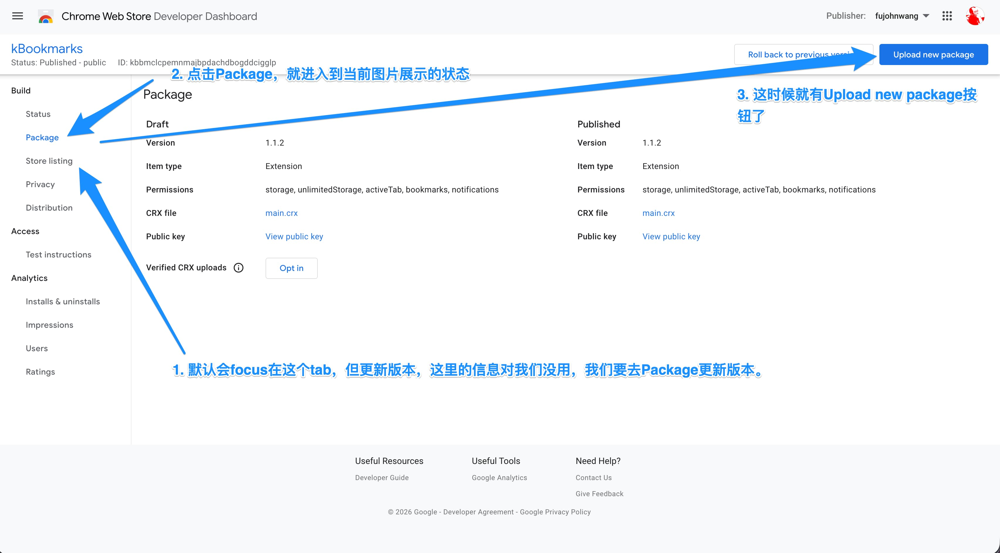

```bash
./publish.sh <Version>
```

然后去 https://chrome.google.com/webstore/devconsole/d12b7608-f2cb-463b-9fa2-76b3ee0bc159 发布。



Chrome web store跟play store和app store的更新操作有点儿不一样，直接upload new package就完了，不用写啥What's new或者submit review啥的😂


> NOTE/记住： 
> 
> 脚本跑完后，它会自己更新package.json和manifest.json里的版本号，所以，跑完脚本再给git打标push，否则，git tag并push后，再跑脚本，文件会有新变更。 


---

以下内容无效了已经：

1. 先修改package.json里的version
2. npm run publish
