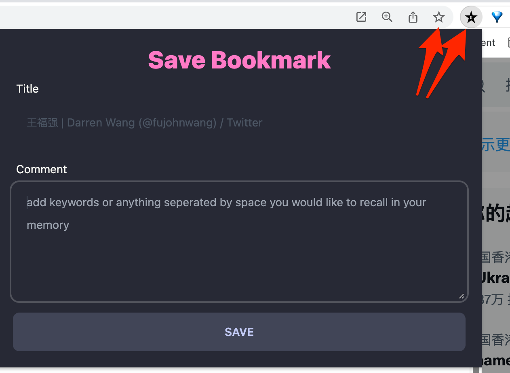
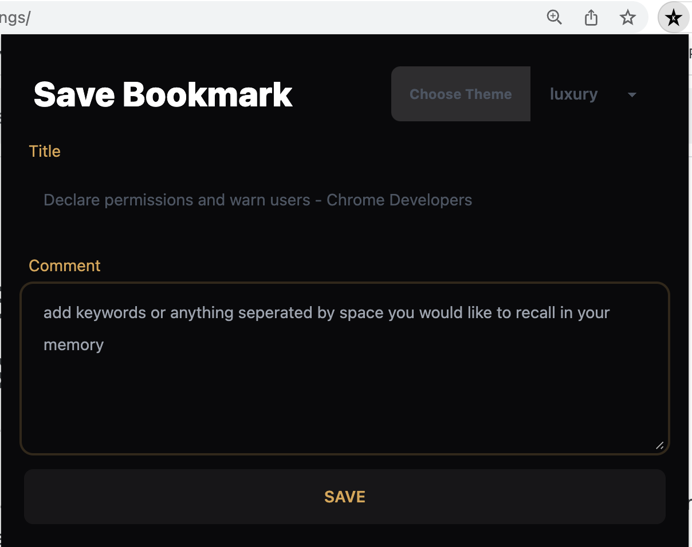
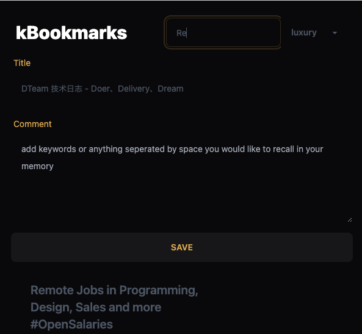
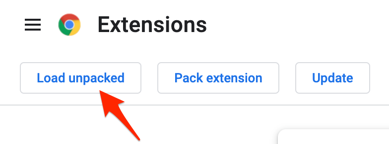
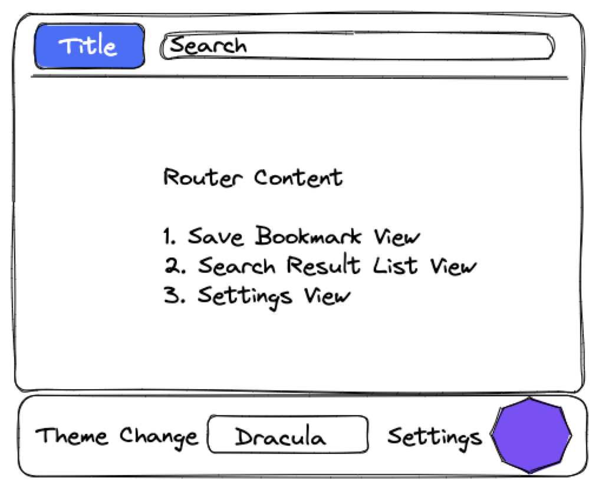

# Intro to kBookmarks

kBookmarks is a Chrome bookmark extension from [KEEVOL](https://keevol.com)

The critical philosophy of this extension is "**For long-tail less-used bookmarks, we can tag them and comment them at save and recall them later on by searching with tags or comment we have left before**".

For bookmarks we use in daily, Folder-based management is OK, so kBookmarks still keep the original bookmark manager functionalities untouched.

书签的管理可以采用`固定目录+长尾标注`的组合方式:

- 经常用的，放到固定目录以及Bookmarks Bar上，
- 不常用的，就不分结构扁平化一股脑放到一个位置， 但追加标注或者标签。

需要的时候，根据自身对标注或者标签的印象去搜索就可以直达了，这就是要打造kBookmarks这个chrome extension的初衷。

## how it looks (so that you are interested in the evolution path)

The original (v0.0.1)

The v0.1.1 (add theme change)

The v0.2.0 (add searching)

# quick start

1. clone this repo to local: `git clone git@github.com:fujohnwang/kbookmark.git`
2. open chrome extensions settings: `chrome://extensions` and swith on "Developer Mode" 

3. open **`public`** folder by clicking "Load unpacked" button 

4. You can enjoy this extension now.

# How to install

<https://github.com/fujohnwang/kbookmark/wiki#how-to-install>

# How to build by yourself?

run `npm run build` and then everything is ready in `public` folder.

# TODO

- [X] remove redundancy of bookmark items
    - update instead of add when same title & same url
- [X] enrich metadata to bookmark with indexedDB
  - [X] load existing comment when popup
- [X] add theme change
- [X] enable notification on done successfully
- [X] add override page to allow users to search and access enriched bookmarks
  - `bookmarks` and `newTab` can be overridden, we choose `bookmarks` as the target. ❎
  - [X] enable search bookmarks by keywords in comment
  - [X] iterate on cursor of indexedDB may have potential bug, dive into it later on 
    - checked,  no such potential bug ✅
      - refer to : <https://stackoverflow.com/questions/68331241/how-does-the-cursor-inside-if-statment-can-loop-using-idbcursor-continue-in-ja>
- [X] add flip link to options/settings view on click the kBookmarks header instead of option page standalone
- [X] we may introduce router-based layout instead of the current list-based in one view.
     
- [X] [package](https://developer.chrome.com/docs/extensions/mv3/linux_hosting/#packaging) and [submit to play store](https://developer.chrome.com/docs/webstore/publish/)
  - > Extensions and themes are served as .crx files. When uploading through the Chrome Developer Dashboard, the dashboard creates the crx file automatically. If published on a personal server, the crx file will need to be created locally or downloaded from the Chrome Web Store.
- [ ] replace raw IndexedDB with jsStore 
  - since currently the search and open/close issues are still buggy with raw IndexedDB

# Ref

- https://www.javascripttutorial.net/web-apis/javascript-indexeddb/
- https://developers.google.com/web/ilt/pwa/working-with-indexeddb
- https://developer.mozilla.org/en-US/docs/Web/API/IndexedDB_API
- https://dev.to/alexeagleson/how-to-use-indexeddb-to-store-data-for-your-web-application-in-the-browser-1o90
- https://developer.mozilla.org/en-US/docs/Web/API/IndexedDB_API
- https://w3c.github.io/IndexedDB/
- https://dev.to/anobjectisa/local-database-and-chrome-extensions-indexeddb-36n