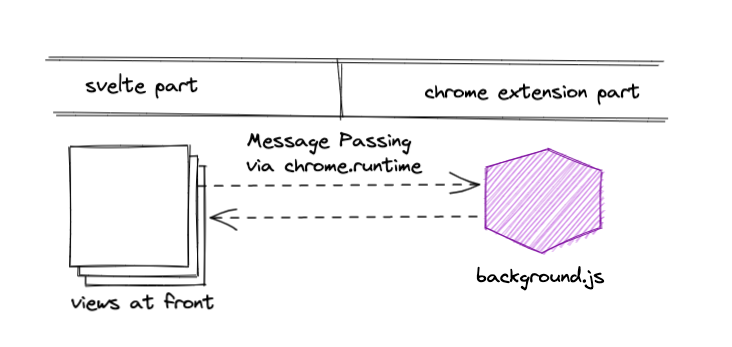
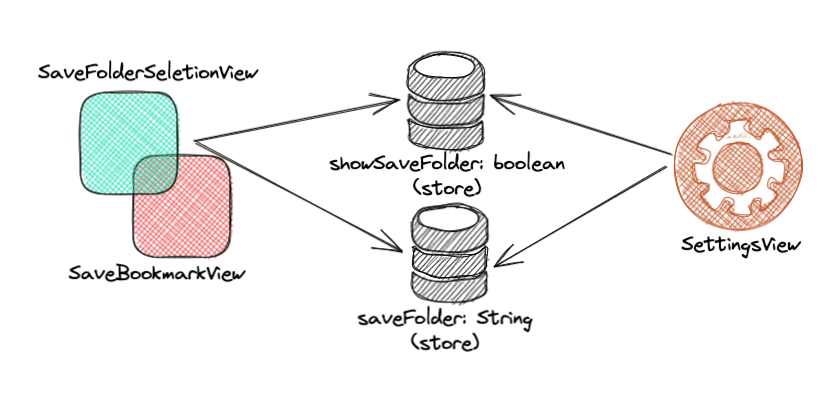

# Design Philosophy

Make everything into a svelte application as much as possible, 
only necessary parts of Chrome extension are included.

At startup(that's the Chrome extension is installed), we will check and create default bookmark folder for kBookmarks (in background.js). 

After that, everything about shared states or storage sync happen in svelte application.

- options/settings will be synced with svelte store backed by chrome.extension.sync;
- default save folder will be synced with svelte store also backed by chrome.extension.sync;

So everything in svelte store about the extension is persisted.

